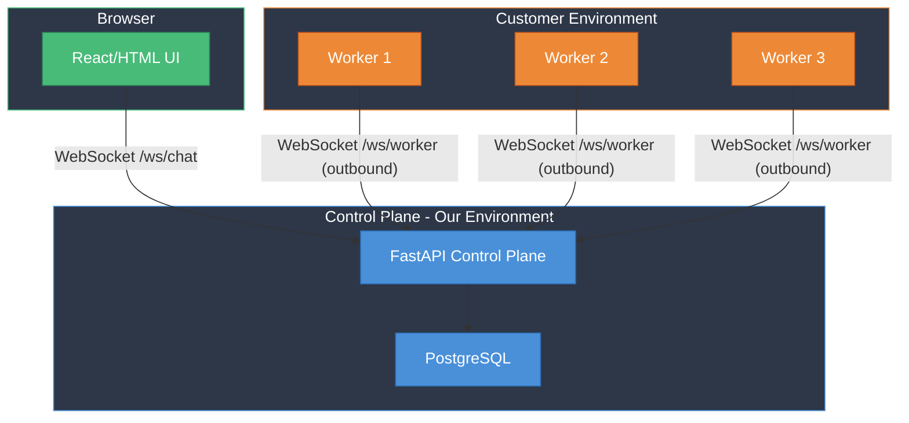
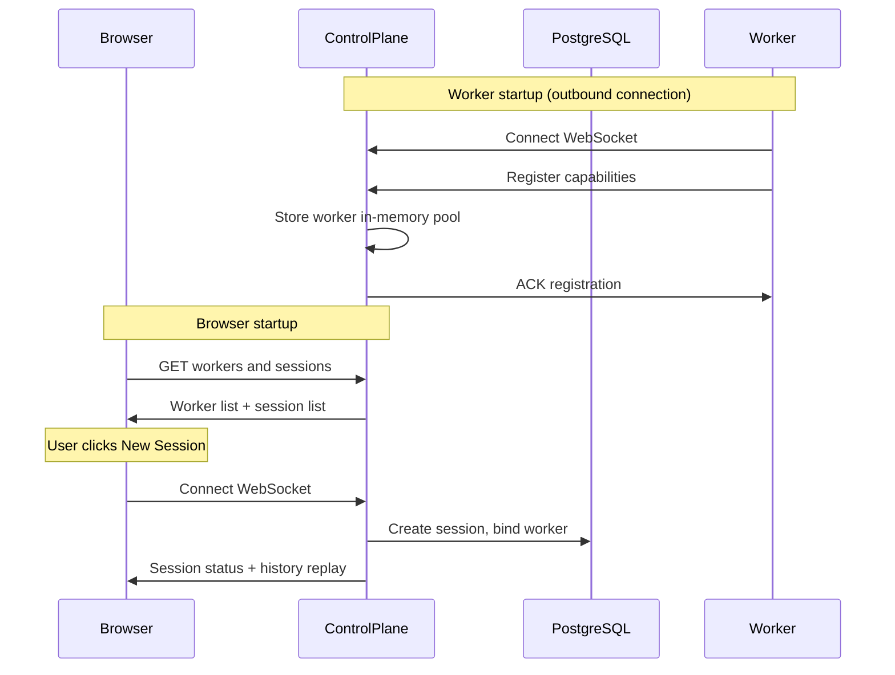
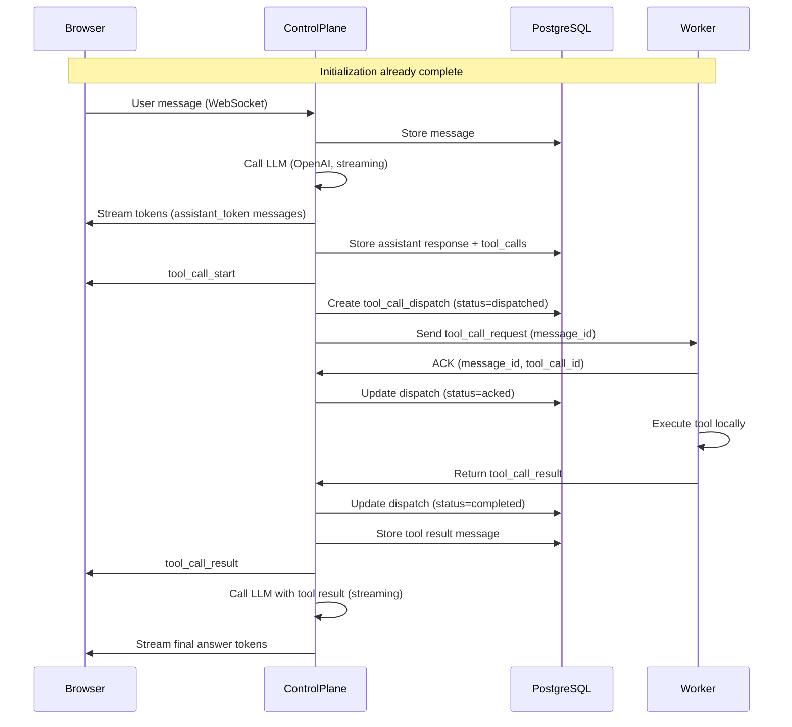
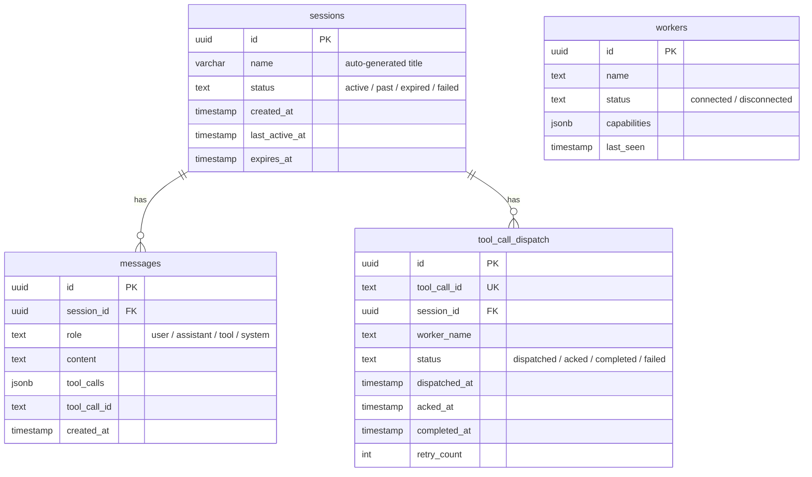

# Remote Tool Execution POC — Demo

---

## The Problem

How do we execute tools in a **customer's environment** when we can't open inbound connections to it?

---

## Demo Agenda

1. **Architecture presentation** — how the pieces fit together
2. **System demo** — end-to-end flow
   - Create a session, send a message, watch tool dispatch + streaming response
   - Show worker binding, session persistence, and reconnect
3. **Failure modes demo** — resilience under stress
   - Kill a worker mid-tool-call → retry on another worker
   - Browser disconnect → reconnect with full history replay
   - Duplicate tool call → idempotent execution (cached result)

---

## Architecture

**Key constraint**: No inbound traffic to customer environment. Workers initiate all connections outbound to the control plane.

---

## Initialization Flow

---

## Tool Call Flow

---

## DB Tables

> **Note**: The `workers` table exists in the schema but is not actively used at runtime. Worker state is managed in-memory via the `WorkerPool` class.

---

## System behaviors

| Name | Description | Behavior |
|------|-------------|----------|
| Worker failure | Worker crashes or disconnects mid-tool-call | Tool call is retried on another available worker (up to 2 retries) |
| Control plane failure | Control plane process crashes or restarts | Workers auto-reconnect; sessions persist in DB and replay on reconnect |
| Tool call loss | Tool call request sent but no ACK received | Dispatch reaper detects unacked dispatches after 5s timeout; marks as failed and triggers retry |
| Duplicate tool call | Same tool call dispatched more than once | Workers cache completed tool_call_ids (60s TTL) and return cached results without re-executing |
| User disconnects | Browser closes or loses connectivity | LLM loop keeps running; messages queue in-memory and drain on reconnect; browser auto-reconnects after 2s with full history replay |
| Session expiry | Session idle beyond TTL | Reaper task checks every 60s; expires sessions 1 hour after last activity; terminates bound worker and marks session as expired |
