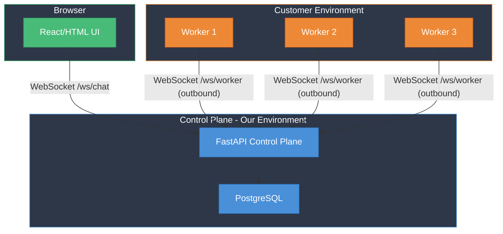
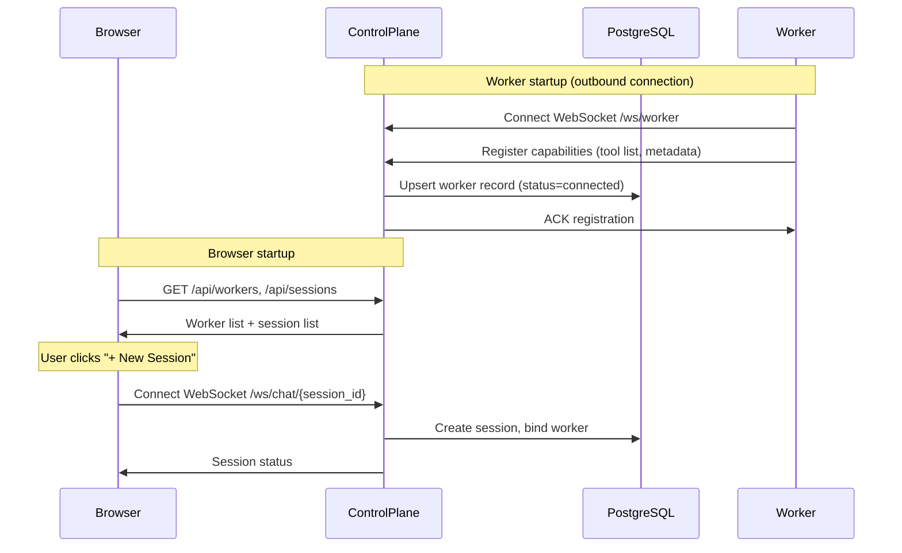
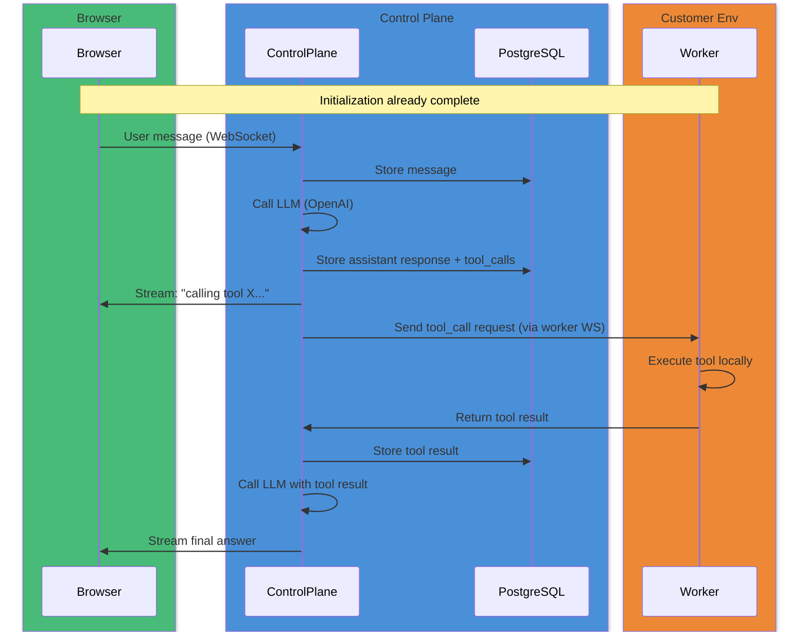
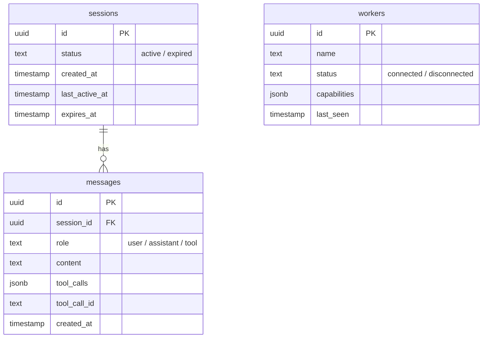

# Remote Tool Execution POC — Demo

---

## The Problem

How do we execute tools in a **customer's environment** when we can't open inbound connections to it?

---

## Architecture

**Key constraint**: No inbound traffic to customer environment. Workers initiate all connections outbound to the control plane.

---

## Initialization Flow

---

## Tool Call Flow

---

## DB Tables

---

## System behaviors

| Name | Description | Behavior |
|------|-------------|----------|
| Worker failure | Worker crashes or disconnects mid-tool-call | Tool call is retried on another available worker (up to 2 retries) |
| Control plane failure | Control plane process crashes or restarts | Workers auto-reconnect; sessions persist in DB and replay on reconnect |
| Tool call loss | Tool call request never reaches worker | Detected as worker disconnect; retried on another worker |
| Duplicate tool call | Same tool call dispatched more than once | Workers cache completed tool_call_ids and return cached results |
| User disconnects | Browser closes or loses connectivity | Session stays active for 1 hour (TTL); auto-expired by reaper task |
