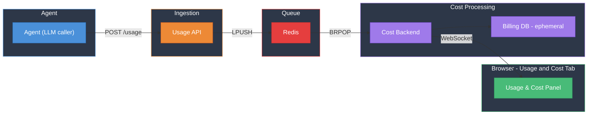

# Usage & Billing PLC — Roadmap

---

## Goal

Track agent LLM usage and costs in real time. Every LLM call produces a usage event that flows through a pipeline (Agent → Usage API → Redis → Cost Backend → Billing DB) and is pushed to the browser via WebSocket as it happens.

---

## Architecture

---

## Key Design Decisions

- **Agent as sole producer** — the control plane's LLM loop emits usage events after each completion; no other component writes usage.
- **Ephemeral Billing DB** — no Docker volume; all cost data is wiped on restart. This is intentional for the POC.
- **Decoupled ingestion and processing** — Usage API and Cost Backend are separate services connected by Redis, mimicking a production pipeline (Kafka, SQS, etc.).
- **Real-time delivery via WebSocket** — the Cost Backend pushes cost updates to the browser for sub-second latency.
- **Dedicated UI tab** — a new "Usage & Cost" tab in the browser's left panel, alongside the existing sessions list.
- **Arbitrary tags on usage events** — usage events carry a flexible JSONB `tags` field, enabling group-by breakdowns on any dimension without schema changes.

---

## Milestone 1: Minimal End-to-End Pipeline (~90 min)

**Objective**: Wire every component together and prove the full pipeline works. Every box in the architecture diagram exists, accepts input, and produces output. Intentionally bare-bones — no breakdowns, no limits, no rich UI.

### Key Outcomes

1. **All new infrastructure starts cleanly** — Redis, Billing DB (ephemeral), Usage API, and Cost Backend all come up with `make up`.
2. **Agent emits usage** — after each LLM streaming call completes, the control plane fires a usage event (model, token counts, session ID) to the Usage API.
3. **Usage flows through the pipeline** — Usage API enqueues to Redis; Cost Backend dequeues, computes cost from a hardcoded pricing table, and stores in Billing DB.
4. **Browser shows live cost** — a new "Usage & Cost" tab in the left panel connects via WebSocket and displays a running total (tokens + dollars) that updates in real time.
5. **Ephemeral data confirmed** — restarting the billing-db container wipes all cost data.

### Decisions for M1

- Usage event schema is minimal: `session_id`, `model`, `prompt_tokens`, `completion_tokens`, `total_tokens`, `timestamp`, `tags` (empty object for now).
- Cost computation uses a static in-memory pricing table (hardcoded per-model rates).
- The agent sends usage fire-and-forget (non-blocking); billing failures do not affect the chat flow.
- The "Usage & Cost" tab shows only a single cumulative counter — no per-call breakdown, no charts.

---

## Milestone 2: Tag-Based Breakdowns & Spending Limits (~90 min)

**Objective**: Make the billing system useful — users can break down costs by arbitrary dimensions and admins can enforce spending limits that block agent activity.

### Key Outcomes

1. **Rich tags on every usage event** — events now carry tags like `worker_name`, `model`, `tool_name`, `session_id`, enabling multi-dimensional analysis.
2. **Breakdown API** — a `GET /costs/breakdown?group_by=<tag>[,<tag>]` endpoint returns costs aggregated by any combination of tag dimensions, with optional `filter_tag=key:value` filtering.
3. **Spending limits** — admins can create limits scoped to a session or globally, with configurable actions:
   - **Warn** — pushes a warning to the browser when a threshold is approached.
   - **Block** — stops all further LLM calls for the session and notifies the browser.
4. **Limit enforcement in the pipeline** — after each cost record is written, the Cost Backend checks limits. If a hard limit is exceeded, it calls back to the control plane to block the session. The agent's LLM loop checks the blocked set before every call.
5. **Enriched "Usage & Cost" tab** — the browser tab now shows a breakdown table with a dimension selector, spending limit progress bars, and warning/block alert banners.

### Decisions for M2

- Breakdowns are powered by dynamic SQL aggregation over JSONB tags (using `jsonb_extract_path_text` in GROUP BY) — no pre-aggregation tables needed.
- Spending limits live in the Billing DB (`spending_limits` table with scope, max_cost, action).
- Enforcement is eventual — a usage event that crosses a limit will be the last one allowed; the block takes effect before the next LLM call.
- The control plane exposes an internal-only `POST /internal/session/{id}/block` endpoint; the Cost Backend is the only caller.
