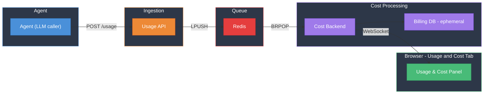

# Usage & Billing PLC — Roadmap

---

## Goal

Track agent LLM usage and costs in real time. Every LLM call produces a usage event that flows through a pipeline (Agent → Usage API → Redis → Cost Backend → Billing DB) and is pushed to the browser via WebSocket as it happens.

---

## Architecture

---

## Key Design Decisions

- **Agent as sole producer** — the control plane's LLM loop emits usage events after each completion; no other component writes usage.
- **Ephemeral Billing DB** — no Docker volume; all cost data is wiped on restart. This is intentional for the POC.
- **Decoupled ingestion and processing** — Usage API and Cost Backend are separate services connected by Redis, mimicking a production pipeline (Kafka, SQS, etc.).
- **Real-time delivery via WebSocket** — the Cost Backend pushes cost updates to the browser for sub-second latency.
- **Dedicated UI tab** — a new "Usage & Cost" tab in the browser's left panel, alongside the existing sessions list.
- **Arbitrary tags on usage events** — usage events carry a flexible JSONB `tags` field, enabling group-by breakdowns on any dimension without schema changes.

---

## Milestone 1: Full Pipeline + Basic Dashboard (~90 min)

**Objective**: Stand up the entire billing pipeline from scratch and prove it works end-to-end. Every box in the architecture diagram exists, accepts input, and produces output. The browser gets a basic but functional cost dashboard with a time-series chart.

### Key Outcomes

1. **All new infrastructure starts cleanly** — Redis, Billing DB (ephemeral), Usage API, and Cost Backend all come up with `make up` alongside the existing control-plane services.
2. **Agent emits usage** — after each LLM streaming call completes, the control plane buffers usage events and flushes them to the Usage API in batches.
3. **Usage flows through the pipeline** — Usage API enqueues to Redis; Cost Backend dequeues, computes cost from a hardcoded pricing table, and stores in Billing DB.
4. **Browser shows live cost dashboard** — a new "Usage & Cost" tab in the sidebar opens a dashboard with a summary card (running total) and a time-series bar chart with cumulative overlay line, auto-refreshing every 5s.
5. **Ephemeral data confirmed** — restarting the billing-db container wipes all cost data (no Docker volume).

### Decisions for M1

- Usage event schema: `call_id`, `event_type`, `org_id`, `provider`, `model`, `session_id`, `session_name`, `timestamp`, `usage` (nested dict from OpenAI response).
- Cost computation uses a static in-memory pricing table (hardcoded per-model rates for prompt, completion, cached tokens).
- The agent buffers usage events and flushes every 2s (fire-and-forget); billing failures do not affect the chat flow.
- The dashboard shows a single-metric bar chart (cost) with a cumulative line — no breakdowns yet.
- The chart uses a 10-minute sliding window as default range.

---

## Milestone 2: Breakdowns + Rich Dashboard (~60 min)

**Objective**: Make the dashboard a powerful exploration tool with flexible grouping, metric toggling, and time navigation.

### Key Outcomes

1. **Usage / Cost toggle** — metric selector switches between viewing dollar costs and raw token counts.
2. **Group-by dimension selector** — users can group data by `provider`, `model`, `usage_type`, or `session_id`. Grouped data renders as stacked bars with distinct colors.
3. **Range presets with time navigation** — range pills (10m, 1h, 1d, 1m) with clock-snapped windows. Arrow buttons navigate to previous/next periods.
4. **Session filter** — dropdown to filter cost data to a single session.
5. **Enriched chart** — Recharts-based ComposedChart with stacked bars, cumulative line on a secondary axis, custom tooltips, future bucket dimming, and a legend with friendly labels.

### Decisions for M2

- Grouping is over first-class columns (`provider`, `model`, `usage_type`, `session_id`) — no JSONB tag queries.
- The `metric` parameter controls whether the API sums `quantity` (usage) or `total_cost` (cost).
- Windows snap to clock boundaries (top of hour, midnight, first of month) rather than sliding, except for the 10m range.
- Session names are displayed in the session filter and in group-by-session breakdowns for readability.

---

## Milestone 3: Pricing Table + Idempotency + Polish (~30 min)

**Objective**: Harden the pipeline for correctness and make the pricing model extensible. This is a "nice-to-have" layer — the dashboard works without it, but these additions prevent duplicate billing and make pricing maintainable.

### Key Outcomes

1. **DB-backed pricing** — `list_prices` table seeded on startup with per-model rates. An in-memory cache avoids DB lookups on every event. A `pricing_updates` table tracks freshness; the cache auto-refreshes hourly.
2. **Idempotent event processing** — `usage` table has a unique constraint on `(event_id, usage_type)`. Duplicate events are silently skipped via `ON CONFLICT DO NOTHING`.
3. **Flat usage decomposition** — nested OpenAI usage dicts (e.g. `prompt_tokens_details.cached_tokens`) are flattened into individual metering rows, each costed independently.
4. **Token fee surcharge** — a synthetic `token_fee` usage type is appended to each event, applying a per-token platform fee on top of LLM provider costs.

### Decisions for M3

- Pricing is seeded from a Python constant (`SEED_PRICES`) — no admin UI for editing prices.
- Wildcard pricing (`provider=*, model=*`) is used for the token fee, falling back when no exact match exists.
- The `costs` table joins to `usage` via `usage_id`, keeping metering and costing cleanly separated.

---

## Future

- **Spending limits** — admins can create limits scoped to a session or globally. The Cost Backend enforces caps and calls back to the control plane to block sessions that exceed their budget.
- **Arbitrary tag-based grouping** — users can group usage and costs by any number of custom tags attached to usage events, enabling fully flexible multi-dimensional analysis.
