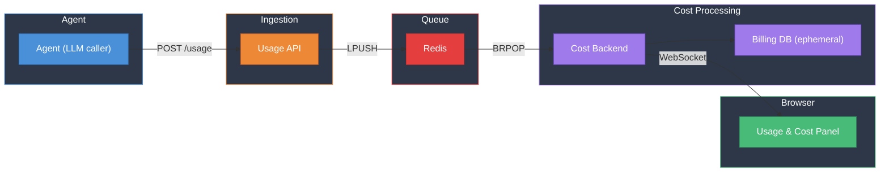
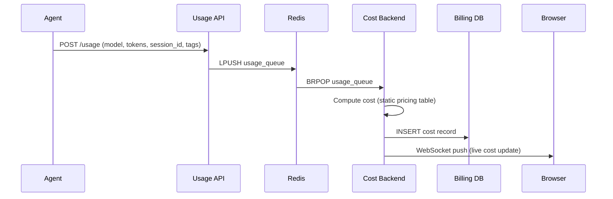
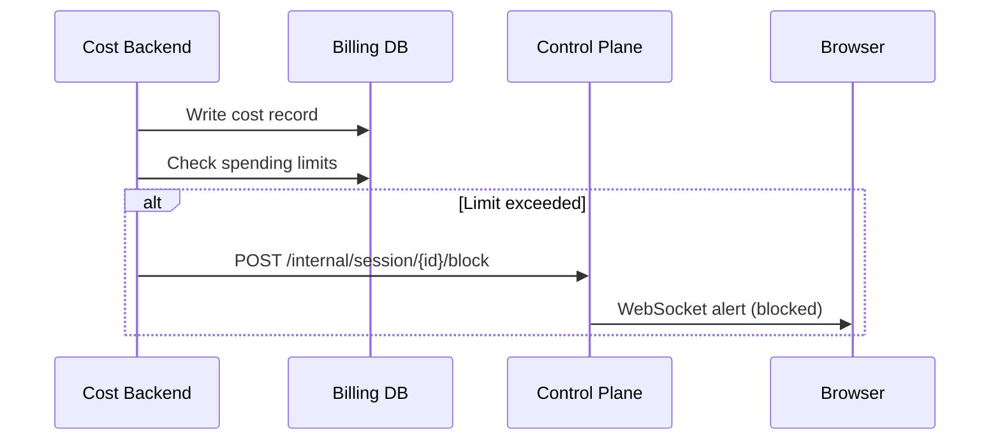

# Usage & Billing System — Demo

---

## The Problem

How do we **track and control LLM costs** in real time, across sessions and models, with flexible breakdowns and spending limits?

---

## Demo Agenda

1. **Architecture overview** — how usage events flow from agent to browser
2. **End-to-end pipeline** — emit a usage event, watch it appear as a live cost update
3. **Breakdowns & limits** — slice costs by any dimension; enforce spending caps

---

## Architecture

---

## Pipeline Flow

---

## Key Design Decisions

| Decision | Rationale |
|----------|-----------|
| Agent is the sole usage producer | Single source of truth — only the LLM loop emits events |
| Ephemeral Billing DB (no Docker volume) | POC trade-off — all cost data wipes on restart |
| Decoupled ingestion & processing | Usage API and Cost Backend are separate services joined by Redis, mirroring production patterns (Kafka, SQS) |
| Fire-and-forget from agent | Billing failures never block the chat flow |
| Flexible JSONB `tags` on events | Enables arbitrary group-by breakdowns without schema changes |
| Real-time WebSocket delivery | Sub-second cost updates pushed to the browser |

---

## Data Schema

Data flows through three successive shapes: the **ingestion event**, the **usage record**, and the **cost record**.

### 1. Usage Event (POST /usage → Redis)

| Field | Description |
|-------|-------------|
| `event_type` | Kind of event (e.g. `llm_completion`) |
| `org_id` | Organization identifier |
| `provider` | LLM provider (e.g. `openai`) |
| `model` | Model used (e.g. `gpt-4o`) |
| `session_id` | Session that triggered the call |
| `timestamp` | ISO-8601 event time |
| `usage` | Dict of usage quantities — keys are usage types (e.g. `prompt_tokens`, `completion_tokens`) |

### 2. `usage` table (Billing DB)

| Column | Description |
|--------|-------------|
| `id` | Primary key (UUID) |
| `event_id` | Unique event identifier for dedup |
| `org_id` | Organization identifier |
| `session_id` | Session that produced this usage |
| `provider` | LLM provider |
| `model` | Model name |
| `event_type` | Kind of event |
| `usage_type` | Specific metric (e.g. `prompt_tokens`) |
| `quantity` | Raw count for this usage type |
| `created_at` | Timestamp of record creation |

> One ingestion event fans out into multiple `usage` rows — one per key in the `usage` dict.

### 3. `costs` table (Billing DB)

| Column | Description |
|--------|-------------|
| `id` | Primary key (UUID) |
| `usage_id` | FK → `usage.id` (cascading delete) |
| `usage_type` | Mirrors usage type for easy querying |
| `unit_cost` | Per-unit price applied |
| `total_cost` | `quantity × unit_cost` |
| `created_at` | Timestamp of record creation |

---

## API Endpoints

### Ingestion

| Method | Endpoint | Description |
|--------|----------|-------------|
| POST | `/usage` | Accepts an array of usage events. Agent buffers events in-memory and flushes as a batch every 2s. |

### Cost & Usage Queries

| Method | Endpoint | Description |
|--------|----------|-------------|
| GET | `/cost?range=10m&offset=0&group_by=model&session_id=<uuid>` | Time-bucketed cost data for the dashboard chart |
| GET | `/usage?range=10m&offset=0&group_by=usage_type&session_id=<uuid>` | Time-bucketed usage (token) data for the dashboard chart |
| GET | `/cost/summary` | All-time cumulative cost and token totals |
| GET | `/cost/summary/{session_id}` | Cumulative cost for a specific session |
| GET | `/usage/summary` | All-time cumulative token totals |

### Query Parameters

| Param | Values | Description |
|-------|--------|-------------|
| `range` | `10m`, `1h`, `1d`, `1m` | Time window for bucketed data |
| `offset` | integer (default 0) | Navigate to previous periods (e.g. offset=1 for the previous window) |
| `group_by` | `provider`, `model`, `usage_type`, `session_id` | Group results by a dimension |
| `session_id` | UUID | Filter to a specific session |
| `metric` | `cost`, `usage` | Toggle between dollar costs and raw token counts (frontend toggle) |

The frontend polls `/cost` or `/usage` every 5 seconds. The `group_by` and `session_id` params are independent — users can filter to one session while grouping by usage type, or group by session across all data.

---

## Spending Limits

| Scope | Action | Behavior |
|-------|--------|----------|
| Session | **Warn** | Push warning banner to browser when threshold is approached |
| Session | **Block** | Stop all LLM calls for the session; notify browser |
| Global | **Warn / Block** | Same actions, applied across all sessions |

Enforcement is **eventual** — the event that crosses a limit is the last one allowed; the block takes effect before the next LLM call.

