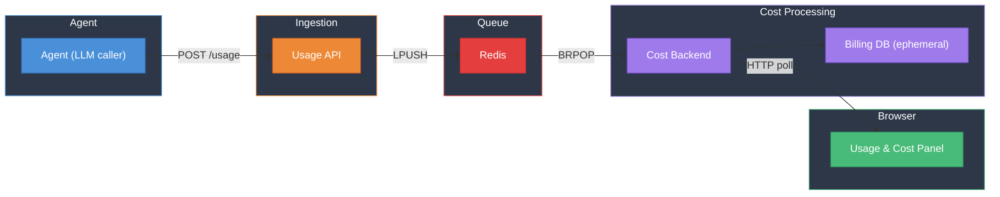

# Usage & Billing System — Demo

---

## The Problem

How do we **track and control LLM costs** in real time, across sessions and models, with flexible breakdowns and spending limits?

---

## Demo Agenda

1. **Architecture overview** — how usage events flow from agent to browser
2. **End-to-end pipeline** — emit a usage event, watch it appear as a live cost update
3. **Breakdowns & limits** — slice costs by any dimension; enforce spending caps

---

## Architecture



---

---

## Data Schema

One ingestion event fans out into multiple `usage` rows (one per usage type), each linked to a `costs` row. Pricing is driven by `list_prices`.

```mermaid
erDiagram
    usage {
        UUID id PK
        VARCHAR200 event_id IX "UQ(event_id, usage_type)"
        INT org_id IX
        VARCHAR100 session_id IX
        VARCHAR50 provider
        VARCHAR100 model
        VARCHAR50 event_type
        VARCHAR100 usage_type
        INT quantity
        TIMESTAMPTZ created_at
    }

    costs {
        UUID id PK
        UUID usage_id FK "ON DELETE CASCADE"
        VARCHAR100 usage_type
        NUMERIC_20_12 unit_cost
        NUMERIC_20_12 total_cost "quantity x unit_cost"
        TIMESTAMPTZ created_at
    }

    list_prices {
        UUID id PK
        VARCHAR50 provider "UQ(provider, model, usage_type)"
        VARCHAR100 model
        VARCHAR100 usage_type
        NUMERIC_20_12 unit_cost
        TIMESTAMPTZ created_at
    }

    pricing_updates {
        VARCHAR50 provider PK
        TIMESTAMPTZ last_update
    }

    usage ||--|| costs : "1:1"
    list_prices ||--o{ costs : "provides unit_cost"
    pricing_updates ||--o{ list_prices : "tracks freshness"
```

---

## API Endpoints

### Ingestion

| Method | Endpoint | Description |
|--------|----------|-------------|
| POST | `/usage` | Accepts an array of usage events. Agent buffers events in-memory and flushes as a batch every 2s. |

### Cost & Usage Queries

| Method | Endpoint | Description |
|--------|----------|-------------|
| GET | `/cost?range=10m&offset=0&group_by=model&session_id=<uuid>` | Time-bucketed cost data for the dashboard chart |
| GET | `/usage?range=10m&offset=0&group_by=usage_type&session_id=<uuid>` | Time-bucketed usage (token) data for the dashboard chart |
| GET | `/cost/summary` | All-time cumulative cost and token totals |
| GET | `/cost/summary/{session_id}` | Cumulative cost for a specific session |
| GET | `/usage/summary` | All-time cumulative token totals |

### Query Parameters

| Param | Values | Description |
|-------|--------|-------------|
| `range` | `10m`, `1h`, `1d`, `1m` | Time window for bucketed data |
| `offset` | integer (default 0) | Navigate to previous periods (e.g. offset=1 for the previous window) |
| `group_by` | `provider`, `model`, `usage_type`, `session_id` | Group results by a dimension |
| `session_id` | UUID | Filter to a specific session |
| `metric` | `cost`, `usage` | Toggle between dollar costs and raw token counts (frontend toggle) |

The frontend polls the cost-backend's `/cost` or `/usage` endpoints every 5 seconds. The `group_by` and `session_id` params are independent — users can filter to one session while grouping by usage type, or group by session across all data.

