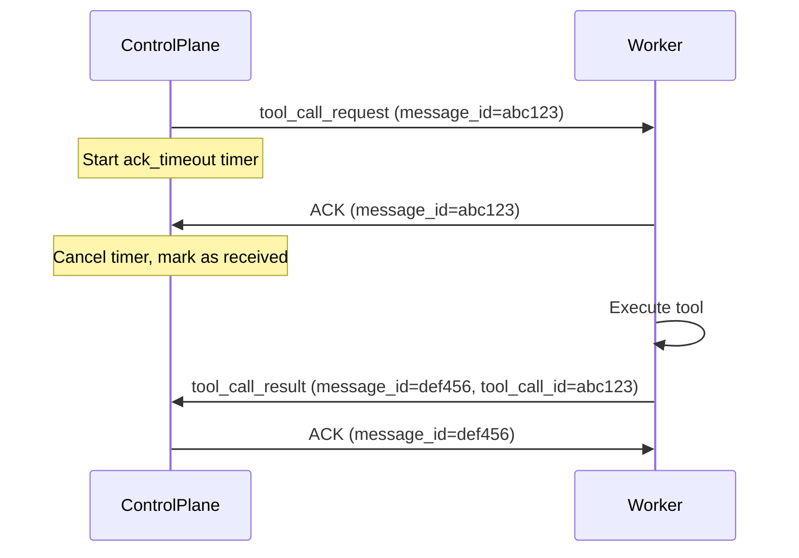

# Remote Tool Execution POC

> Architecture and flow diagrams are in [PRESENTATION.md](PRESENTATION.md).

## Tech Stack

- **Control Plane**: Python 3.12, FastAPI, asyncio, websockets, sqlalchemy + asyncpg
- **Database**: PostgreSQL 16
- **Workers**: Python 3.12, websockets client, subprocess for tool execution
- **UI**: Single-file HTML/JS (served by FastAPI, no build step)
- **Infra**: Docker Compose with 6 services (control-plane, postgres, worker-1, worker-2, worker-3, plus an optional pgadmin)

## Database Schema (minimal)

- **sessions**: id, created_at
- **messages**: id, session_id, role (user/assistant/tool), content, tool_calls (jsonb), tool_call_id, created_at
- **workers**: id, name, status (connected/disconnected), capabilities (jsonb), last_seen

---

## Milestone 1: Full End-to-End MVP (~90 min)

Goal: Stand up the entire system from scratch and get a working end-to-end flow -- browser sends message, control plane calls LLM with streaming, LLM requests a tool, tool request is dispatched to a worker, worker executes it, result flows back through LLM to browser. This is the "big bang" milestone -- the hardest and most critical.

### Files to create

- `docker-compose.yml` -- 6 services: postgres, control-plane, worker-1, worker-2, worker-3 (workers share same image, different env vars)
- `Makefile` -- targets: `build`, `up`, `down`, `logs`, `reset-db`
- `control-plane/Dockerfile`
- `control-plane/requirements.txt` -- fastapi, uvicorn, websockets, sqlalchemy, asyncpg, openai, python-dotenv
- `control-plane/app/main.py` -- FastAPI app with:
  - `GET /` serves the HTML UI
  - `WS /ws/chat/{session_id}` for browser connections
  - `WS /ws/worker` for worker connections (workers register with capabilities)
  - LLM integration (OpenAI chat completions with streaming + tool definitions)
  - Worker pool management (round-robin or capability-based dispatch)
- `control-plane/app/database.py` -- async SQLAlchemy engine + session factory
- `control-plane/app/models.py` -- SQLAlchemy ORM models (sessions, messages, workers)
- `control-plane/app/schemas.py` -- Pydantic models for WS message protocol
- `control-plane/app/ui/index.html` -- chat UI with session creation (vanilla JS + WebSocket)
- `worker/Dockerfile`
- `worker/requirements.txt` -- websockets, python-dotenv
- `worker/main.py` -- connects to control plane WS, registers capabilities, listens for tool calls, executes them, returns results
- `.env.example` -- OPENAI_API_KEY, DATABASE_URL, etc.

### MVP Tool Set (hardcoded in workers)

Workers support 4 tools:
1. `bash` -- run a shell command and return stdout/stderr
2. `read_file` -- read file contents from the worker filesystem
3. `write_file` -- write content to a file on the worker filesystem
4. `get_system_info` -- return hostname, OS, uptime, etc.

### What "works" at end of M1
- `make up` starts everything
- Open browser to `localhost:8000`, click "+ New Session"
- Type "what worker are you connected to?" or "list files in /tmp"
- LLM decides to call a tool, control plane routes it to a bound worker, result streams back token-by-token, LLM responds
- Tool call status indicators in UI (pending/running/complete/failed)

---

## Milestone 2: Multi-session, Persistence, and Worker Dashboard (~60 min)

**Objective**: Make the system feel like a real product -- multiple sessions with full persistence, a worker dashboard, and polished session lifecycle management.

### Key Outcomes

1. **Full DB persistence** -- reload conversation history on browser reconnect, messages survive restarts.
2. **Session management UI** -- sidebar with create/switch/delete sessions, active vs. past sessions split, auto-generated session names from the first user message.
3. **Worker dashboard panel** -- sidebar shows connected workers and their bound-to-session status.
4. **Session-worker binding** -- each session gets a dedicated worker (1:1 binding), persisted in DB and restored on reconnect.
5. **Worker failure handling** -- worker disconnect shows failure banner with "Reconnect to new sandbox" button, auto-rebinding to available workers.
6. **Past session viewing** -- read-only view of ended/expired sessions with full history replay.
7. **Capacity gating** -- new sessions blocked when no workers are available, UI reflects this.

---

## Milestone 3: Reliability -- At-Least-Once Delivery + Idempotency (~30 min)

Goal: Ensure every tool call is executed at least once (even if a worker crashes mid-flight) and that duplicate processing is impossible. This is a "nice-to-have" layer -- the app works perfectly without it, but is more resilient with it.

### Message Acknowledgment Protocol

Every message sent over WebSocket (control-plane-to-worker) gets a unique `message_id`. The worker must reply with an explicit `ACK`:

If no ACK is received within `ack_timeout` (e.g. 5s), the control plane marks the dispatch as failed and the retry logic kicks in.

### Idempotency Keys

- **Worker side**: Each tool call has a globally unique `tool_call_id`. Before executing, the worker checks a local in-memory cache of already-executed IDs (with TTL). If seen before, it returns the cached result without re-executing.
- **Browser side**: Each message pushed to the browser carries a `message_id`. The UI maintains a `Set` of rendered message IDs. Duplicates are silently dropped.
- **DB side**: The `messages` table has a unique constraint on `(session_id, tool_call_id)` for tool-role messages, preventing duplicate storage.

### Implementation Details

- `tool_call_dispatch` table tracks dispatch lifecycle: `dispatched -> acked -> completed` (or `failed`), with `retry_count`.
- Dispatch reaper: async background task that periodically scans for dispatched-but-unacked tool calls past their timeout and marks them failed, triggering retry.
- Worker heartbeat loop (every 15s) + health checker that force-disconnects stale workers.
- Workers maintain a `dict[str, tuple[str, float]]` cache of completed tool_call_ids so redelivered requests return instantly.
- `/debug/replay` endpoint to re-send a tool call and test idempotency.
- `/debug/dispatches` endpoint to inspect dispatch state.
- Chaos testing Makefile targets: `chaos-kill-worker`, `chaos-kill-control-plane`, `chaos-duplicate`.
