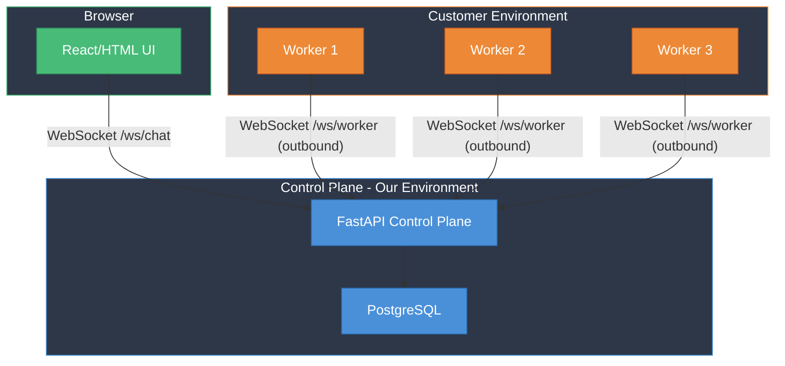
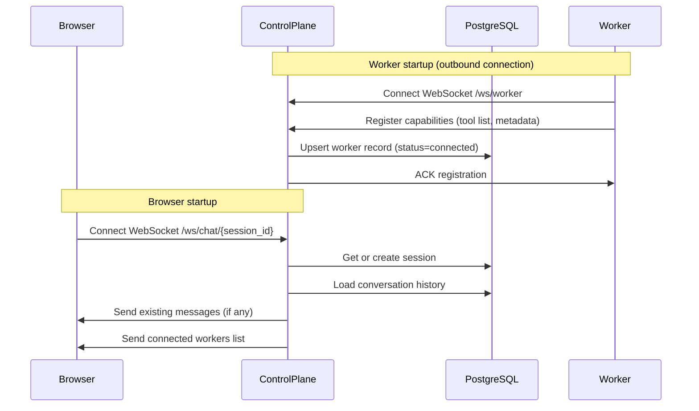
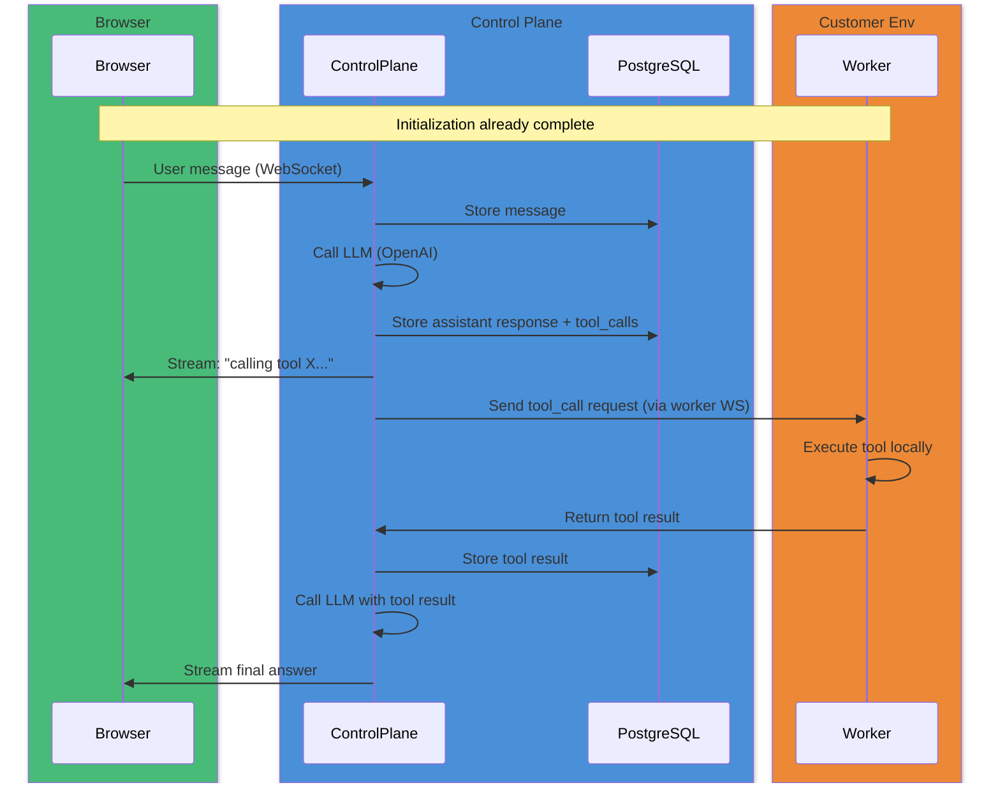
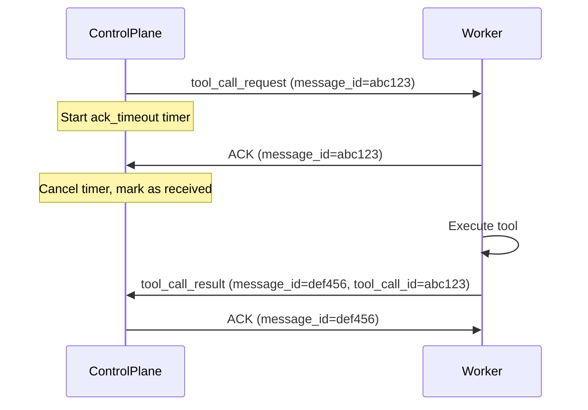

# Remote Tool Execution POC

## Architecture

**Key constraint**: No inbound traffic to customer environment. Workers initiate all connections outbound to the control plane.

## Initialization Flow

## Tool Call Flow

## Tech Stack

- **Control Plane**: Python 3.12, FastAPI, asyncio, websockets, sqlalchemy + asyncpg
- **Database**: PostgreSQL 16
- **Workers**: Python 3.12, websockets client, subprocess for tool execution
- **UI**: Single-file HTML/JS (served by FastAPI, no build step)
- **Infra**: Docker Compose with 6 services (control-plane, postgres, worker-1, worker-2, worker-3, plus an optional pgadmin)

## Database Schema (minimal)

- **sessions**: id, created_at
- **messages**: id, session_id, role (user/assistant/tool), content, tool_calls (jsonb), tool_call_id, created_at
- **workers**: id, name, status (connected/disconnected), capabilities (jsonb), last_seen

---

## Milestone 1: Scaffolding + End-to-End MVP (~60 min)

Goal: Get all containers running with a working end-to-end flow -- browser sends message, control plane calls LLM, LLM requests a tool, tool request is dispatched to a worker, worker executes it, result flows back through LLM to browser.

### Files to create

- `docker-compose.yml` -- 6 services: postgres, control-plane, worker-1, worker-2, worker-3 (workers share same image, different env vars)
- `Makefile` -- targets: `build`, `up`, `down`, `logs`, `reset-db`
- `control-plane/Dockerfile`
- `control-plane/requirements.txt` -- fastapi, uvicorn, websockets, sqlalchemy, asyncpg, openai, python-dotenv
- `control-plane/app/main.py` -- FastAPI app with:
  - `GET /` serves the HTML UI
  - `WS /ws/chat/{session_id}` for browser connections
  - `WS /ws/worker` for worker connections (workers register with capabilities)
  - LLM integration (OpenAI chat completions with tool definitions)
  - Worker pool management (round-robin or capability-based dispatch)
- `control-plane/app/database.py` -- async SQLAlchemy engine + session factory
- `control-plane/app/models.py` -- SQLAlchemy ORM models (sessions, messages, workers)
- `control-plane/app/schemas.py` -- Pydantic models for WS message protocol
- `control-plane/app/ui/index.html` -- minimal chat UI (vanilla JS + WebSocket)
- `worker/Dockerfile`
- `worker/requirements.txt` -- websockets, python-dotenv
- `worker/main.py` -- connects to control plane WS, registers capabilities, listens for tool calls, executes them, returns results
- `.env.example` -- OPENAI_API_KEY, DATABASE_URL, etc.

### MVP Tool Set (hardcoded in workers)

For M1, workers support 2 simple tools:
1. `execute_shell` -- run a shell command and return stdout/stderr
2. `get_system_info` -- return hostname, OS, uptime, etc.

### What "works" at end of M1
- `make up` starts everything
- Open browser to `localhost:8000`, type "what worker are you connected to?" or "list files in /tmp on worker-1"
- LLM decides to call a tool, control plane routes it to a worker, result comes back, LLM responds

---

## Milestone 2: Persistence, Multi-session, and Robust Worker Management (~60 min)

- Full DB persistence: reload conversation history on reconnect
- Session management UI: create/switch/delete sessions
- Worker health monitoring: heartbeat, auto-reconnect with exponential backoff
- Worker capability registration: workers declare what tools they support
- Proper error handling: worker disconnects mid-tool-call, timeouts, retries
- Tool call status indicators in UI (pending/running/complete/failed)
- Targeted routing: user can specify which worker should execute a tool

---

## Milestone 3: Polish, Streaming, and Demo-Ready (~60 min)

- LLM streaming responses (token-by-token to browser via WebSocket)
- Worker dashboard panel in UI: show connected workers, their status, capabilities
- Conversation history panel with tool call details expandable
- Add 1-2 more interesting tools: `read_file`, `http_request`
- Rate limiting and basic auth token for worker connections
- Graceful shutdown handling
- README.md with architecture diagram and setup instructions

---

## Milestone 4: Reliability -- At-Least-Once Delivery + Idempotency (~45 min)

Goal: Ensure every tool call is executed at least once (even if a worker crashes mid-flight) and that duplicate processing is impossible -- neither workers re-execute the same tool call nor the browser renders the same message twice.

### Message Acknowledgment Protocol

Every message sent over WebSocket (control-plane-to-worker and control-plane-to-browser) gets a unique `message_id`. The receiver must reply with an explicit `ACK`:

If no ACK is received within `ack_timeout` (e.g. 10s), the control plane:
1. Marks the tool call as `pending_retry` in the DB
2. Reassigns it to another available worker (or the same one if reconnected)

### Idempotency Keys

- **Worker side**: Each tool call has a globally unique `tool_call_id`. Before executing, the worker checks a local in-memory set of already-executed IDs. If seen before, it returns the cached result without re-executing. This prevents duplicate execution on redelivery.
- **Browser side**: Each message pushed to the browser carries a `message_id`. The UI maintains a `Set` of rendered message IDs. If a message_id was already rendered, it is silently dropped. This prevents duplicate messages in the chat.
- **DB side**: The `messages` table has a unique constraint on `(session_id, tool_call_id)` for tool-role messages, preventing duplicate storage.

### New DB columns

- **tool_call_dispatch** table (or columns on messages): `dispatch_id`, `tool_call_id`, `worker_id`, `status` (dispatched/acked/completed/timeout/failed), `dispatched_at`, `acked_at`, `completed_at`, `retry_count`

### Implementation Details

- Control plane runs an async background task that periodically scans for dispatched-but-unacked tool calls past their timeout and re-dispatches them
- Workers maintain a `dict[str, ToolResult]` cache of completed tool_call_ids so redelivered requests return instantly
- Browser JS maintains `const renderedMessageIds = new Set()` and skips duplicates in the WebSocket `onmessage` handler
- Add a `/debug/replay` endpoint that re-sends a tool call to test idempotency manually

### Chaos Testing

- `make chaos-kill-worker` -- kills a random worker container mid-execution, verify the tool call is retried on another worker
- `make chaos-duplicate` -- sends the same tool_call_request twice to a worker, verify it only executes once
- Add a "chaos mode" toggle in UI that randomly drops ACKs to exercise retry logic
